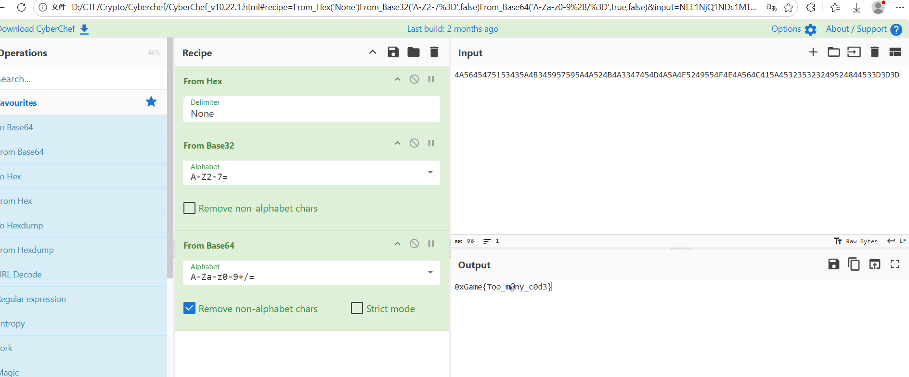

## 1.ezVigenere-0xGame

描述：0xGame{}

file.txt

```
Tig Vjieogrf eiqjes ks b oeujoe qf fpcsapuknh clqjacgtje tfzt ca utknh c sftifu og knugrxqvfp Cbgsbt cjrhfts, ccsff oo vhf neuvesu og c kfawptd. Jv enrlpas b hoso og romaamrhbdeukc twbtviuwtjqn.
Gkrtv dfucskbff bz Iipxao Dauvitva Cglmcsp kn 1553, uje dkpigr ju ebuy uq uofesutbpd bpd jopmgmfpt, cwt jv rfuitvee clm ctugmqvs uq bsgal kt vptjn 1863, titef eeovusket naugr. Ujit gaspee kt uje egsdtiqvipp lf ehjhfscgf knegcikfgtacne (Gteoeh gqr 'uje jpdfeiqjescbmg cjrhft'). Mbpy qgoqne icvf vrjgd uq inrlfoeov eoerzrtjqn tehfoet vhbv asg etueovibnlz Xihgnfte dkpigrt. Kn 1863, Gtiffrjeh Lcsjukj yat vhf hisut uq pvdljuh b ieogrbn mfvhpf og fedkpigrjpg Wkgfpesg cjrhfts. Jp tig 19ti eeovusa tig sdjeng wbu mjuauvrjduugd uq Bmcitg df Xihgnfte, bpd tq adsujtee ktt rrfueov nboe.0yIang{iovesgsu1pg_Wkgfpesg}
```

提取信息：0yIang{iovesgsu1pg_Wkgfpesg}

寻找密钥：Tig Vjieogrf与the Vigenere长度一样且相似

那么，根据密码表得到abcabcabcab

删除重复得到密钥abc

随波逐流解密得到

```
The Vigenere cipher is a method of encrypting alphabetic text by using a series of interwoven Caesar ciphers, based on the letters of a keyword. It employs a form of polyalphabetic substitution.
First described by Giovan Battista Bellaso in 1553, the cipher is easy to understand and implement, but it resisted all attempts to break it until 1863, three centuries later. This earned it the description le chiffrage indechiffrable (French for 'the indecipherable cipher'). Many people have tried to implement encryption schemes that are essentially Vigenere ciphers. In 1863, Friedrich Kasiski was the first to publish a general method of deciphering Vigenere ciphers. In the 19th century the scheme was misattributed to Blaise de Vigenere, and so acquired its present name.0xGame{interest1ng_Vigenere}
```

## 2.manyCode-0xGame

manycode-updated.txt

```
ﾟωﾟﾉ= /｀ｍ´）ﾉ ~┻━┻   //*´∇｀*/ ['_']; o=(ﾟｰﾟ)  =_=3; c=(ﾟΘﾟ) =(ﾟｰﾟ)-(ﾟｰﾟ); (ﾟДﾟ) =(ﾟΘﾟ)= (o^_^o)/ (o^_^o);(ﾟДﾟ)={ﾟΘﾟ: '_' ,ﾟωﾟﾉ : ((ﾟωﾟﾉ==3) +'_') [ﾟΘﾟ] ,ﾟｰﾟﾉ :(ﾟωﾟﾉ+ '_')[o^_^o -(ﾟΘﾟ)] ,ﾟДﾟﾉ:((ﾟｰﾟ==3) +'_')[ﾟｰﾟ] }; (ﾟДﾟ) [ﾟΘﾟ] =((ﾟωﾟﾉ==3) +'_') [c^_^o];(ﾟДﾟ) ['c'] = ((ﾟДﾟ)+'_') [ (ﾟｰﾟ)+(ﾟｰﾟ)-(ﾟΘﾟ) ];(ﾟДﾟ) ['o'] = ((ﾟДﾟ)+'_') [ﾟΘﾟ];(ﾟoﾟ)=(ﾟДﾟ) ['c']+(ﾟДﾟ) ['o']+(ﾟωﾟﾉ +'_')[ﾟΘﾟ]+ ((ﾟωﾟﾉ==3) +'_') [ﾟｰﾟ] + ((ﾟДﾟ) +'_') [(ﾟｰﾟ)+(ﾟｰﾟ)]+ ((ﾟｰﾟ==3) +'_') [ﾟΘﾟ]+((ﾟｰﾟ==3) +'_') [(ﾟｰﾟ) - (ﾟΘﾟ)]+(ﾟДﾟ) ['c']+((ﾟДﾟ)+'_') [(ﾟｰﾟ)+(ﾟｰﾟ)]+ (ﾟДﾟ) ['o']+((ﾟｰﾟ==3) +'_') [ﾟΘﾟ];(ﾟДﾟ) ['_'] =(o^_^o) [ﾟoﾟ] [ﾟoﾟ];(ﾟεﾟ)=((ﾟｰﾟ==3) +'_') [ﾟΘﾟ]+ (ﾟДﾟ) .ﾟДﾟﾉ+((ﾟДﾟ)+'_') [(ﾟｰﾟ) + (ﾟｰﾟ)]+((ﾟｰﾟ==3) +'_') [o^_^o -ﾟΘﾟ]+((ﾟｰﾟ==3) +'_') [ﾟΘﾟ]+ (ﾟωﾟﾉ +'_') [ﾟΘﾟ]; (ﾟｰﾟ)+=(ﾟΘﾟ); (ﾟДﾟ)[ﾟεﾟ]='\\'; (ﾟДﾟ).ﾟΘﾟﾉ=(ﾟДﾟ+ ﾟｰﾟ)[o^_^o -(ﾟΘﾟ)];(oﾟｰﾟo)=(ﾟωﾟﾉ +'_')[c^_^o];(ﾟДﾟ) [ﾟoﾟ]='\"';(ﾟДﾟ) ['_'] ( (ﾟДﾟ) ['_'] (ﾟεﾟ+(ﾟДﾟ)[ﾟoﾟ]+ (ﾟДﾟ)[ﾟεﾟ]+((o^_^o) +(o^_^o))+ (ﾟｰﾟ)+ (ﾟДﾟ)[ﾟεﾟ]+(ﾟΘﾟ)+ (c^_^o)+ (ﾟΘﾟ)+ (ﾟДﾟ)[ﾟεﾟ]+((o^_^o) +(o^_^o))+ ((ﾟｰﾟ) + (ﾟΘﾟ))+ (ﾟДﾟ)[ﾟεﾟ]+((o^_^o) +(o^_^o))+ ((o^_^o) +(o^_^o))+ (ﾟДﾟ)[ﾟεﾟ]+((o^_^o) +(o^_^o))+ (ﾟｰﾟ)+ (ﾟДﾟ)[ﾟεﾟ]+((o^_^o) +(o^_^o))+ ((ﾟｰﾟ) + (ﾟΘﾟ))+ (ﾟДﾟ)[ﾟεﾟ]+((o^_^o) +(o^_^o))+ (ﾟｰﾟ)+ (ﾟДﾟ)[ﾟεﾟ]+((o^_^o) +(o^_^o))+ ((ﾟｰﾟ) + (o^_^o))+ (ﾟДﾟ)[ﾟεﾟ]+((o^_^o) +(o^_^o))+ ((ﾟｰﾟ) + (ﾟΘﾟ))+ (ﾟДﾟ)[ﾟεﾟ]+((o^_^o) +(o^_^o))+ (ﾟΘﾟ)+ (ﾟДﾟ)[ﾟεﾟ]+((o^_^o) +(o^_^o))+ ((ﾟｰﾟ) + (ﾟΘﾟ))+ (ﾟДﾟ)[ﾟεﾟ]+((o^_^o) +(o^_^o))+ (o^_^o)+ (ﾟДﾟ)[ﾟεﾟ]+((o^_^o) +(o^_^o))+ (ﾟｰﾟ)+ (ﾟДﾟ)[ﾟεﾟ]+((o^_^o) +(o^_^o))+ (o^_^o)+ (ﾟДﾟ)[ﾟεﾟ]+((o^_^o) +(o^_^o))+ ((ﾟｰﾟ) + (ﾟΘﾟ))+ (ﾟДﾟ)[ﾟεﾟ]+(ﾟΘﾟ)+ (c^_^o)+ (ﾟΘﾟ)+ (ﾟДﾟ)[ﾟεﾟ]+((o^_^o) +(o^_^o))+ (ﾟｰﾟ)+ (ﾟДﾟ)[ﾟεﾟ]+(ﾟΘﾟ)+ (c^_^o)+ ((o^_^o) - (ﾟΘﾟ))+ (ﾟДﾟ)[ﾟεﾟ]+((o^_^o) +(o^_^o))+ (o^_^o)+ (ﾟДﾟ)[ﾟεﾟ]+((o^_^o) +(o^_^o))+ (ﾟｰﾟ)+ (ﾟДﾟ)[ﾟεﾟ]+((o^_^o) +(o^_^o))+ ((ﾟｰﾟ) + (ﾟΘﾟ))+ (ﾟДﾟ)[ﾟεﾟ]+((ﾟｰﾟ) + (o^_^o))+ (ﾟΘﾟ)+ (ﾟДﾟ)[ﾟεﾟ]+((o^_^o) +(o^_^o))+ ((ﾟｰﾟ) + (ﾟΘﾟ))+ (ﾟДﾟ)[ﾟεﾟ]+((o^_^o) +(o^_^o))+ ((ﾟｰﾟ) + (o^_^o))+ (ﾟДﾟ)[ﾟεﾟ]+((o^_^o) +(o^_^o))+ ((ﾟｰﾟ) + (ﾟΘﾟ))+ (ﾟДﾟ)[ﾟεﾟ]+((ﾟｰﾟ) + (o^_^o))+ (ﾟΘﾟ)+ (ﾟДﾟ)[ﾟεﾟ]+((o^_^o) +(o^_^o))+ ((ﾟｰﾟ) + (ﾟΘﾟ))+ (ﾟДﾟ)[ﾟεﾟ]+(ﾟΘﾟ)+ (c^_^o)+ (ﾟΘﾟ)+ (ﾟДﾟ)[ﾟεﾟ]+((o^_^o) +(o^_^o))+ (ﾟｰﾟ)+ (ﾟДﾟ)[ﾟεﾟ]+(ﾟΘﾟ)+ (c^_^o)+ (ﾟΘﾟ)+ (ﾟДﾟ)[ﾟεﾟ]+((o^_^o) +(o^_^o))+ ((ﾟｰﾟ) + (ﾟΘﾟ))+ (ﾟДﾟ)[ﾟεﾟ]+((o^_^o) +(o^_^o))+ ((o^_^o) - (ﾟΘﾟ))+ (ﾟДﾟ)[ﾟεﾟ]+((o^_^o) +(o^_^o))+ (ﾟｰﾟ)+ (ﾟДﾟ)[ﾟεﾟ]+(ﾟΘﾟ)+ (c^_^o)+ ((o^_^o) - (ﾟΘﾟ))+ (ﾟДﾟ)[ﾟεﾟ]+((o^_^o) +(o^_^o))+ (ﾟｰﾟ)+ (ﾟДﾟ)[ﾟεﾟ]+(ﾟΘﾟ)+ (c^_^o)+ (ﾟΘﾟ)+ (ﾟДﾟ)[ﾟεﾟ]+((o^_^o) +(o^_^o))+ (o^_^o)+ (ﾟДﾟ)[ﾟεﾟ]+((o^_^o) +(o^_^o))+ (o^_^o)+ (ﾟДﾟ)[ﾟεﾟ]+((o^_^o) +(o^_^o))+ (ﾟｰﾟ)+ (ﾟДﾟ)[ﾟεﾟ]+((o^_^o) +(o^_^o))+ ((ﾟｰﾟ) + (o^_^o))+ (ﾟДﾟ)[ﾟεﾟ]+((o^_^o) +(o^_^o))+ (ﾟｰﾟ)+ (ﾟДﾟ)[ﾟεﾟ]+((o^_^o) +(o^_^o))+ ((ﾟｰﾟ) + (ﾟΘﾟ))+ (ﾟДﾟ)[ﾟεﾟ]+((o^_^o) +(o^_^o))+ (ﾟｰﾟ)+ (ﾟДﾟ)[ﾟεﾟ]+(ﾟΘﾟ)+ (c^_^o)+ (ﾟｰﾟ)+ (ﾟДﾟ)[ﾟεﾟ]+((o^_^o) +(o^_^o))+ (ﾟｰﾟ)+ (ﾟДﾟ)[ﾟεﾟ]+(ﾟΘﾟ)+ (c^_^o)+ (ﾟΘﾟ)+ (ﾟДﾟ)[ﾟεﾟ]+((o^_^o) +(o^_^o))+ ((ﾟｰﾟ) + (ﾟΘﾟ))+ (ﾟДﾟ)[ﾟεﾟ]+(ﾟΘﾟ)+ (c^_^o)+ (ﾟΘﾟ)+ (ﾟДﾟ)[ﾟεﾟ]+((o^_^o) +(o^_^o))+ (ﾟｰﾟ)+ (ﾟДﾟ)[ﾟεﾟ]+(ﾟΘﾟ)+ (c^_^o)+ ((o^_^o) +(o^_^o))+ (ﾟДﾟ)[ﾟεﾟ]+((o^_^o) +(o^_^o))+ ((ﾟｰﾟ) + (ﾟΘﾟ))+ (ﾟДﾟ)[ﾟεﾟ]+((o^_^o) +(o^_^o))+ ((o^_^o) - (ﾟΘﾟ))+ (ﾟДﾟ)[ﾟεﾟ]+((o^_^o) +(o^_^o))+ (ﾟｰﾟ)+ (ﾟДﾟ)[ﾟεﾟ]+((ﾟｰﾟ) + (o^_^o))+ (ﾟΘﾟ)+ (ﾟДﾟ)[ﾟεﾟ]+((o^_^o) +(o^_^o))+ ((ﾟｰﾟ) + (ﾟΘﾟ))+ (ﾟДﾟ)[ﾟεﾟ]+((o^_^o) +(o^_^o))+ ((ﾟｰﾟ) + (ﾟΘﾟ))+ (ﾟДﾟ)[ﾟεﾟ]+((o^_^o) +(o^_^o))+ (ﾟｰﾟ)+ (ﾟДﾟ)[ﾟεﾟ]+(ﾟΘﾟ)+ (c^_^o)+ ((o^_^o) +(o^_^o))+ (ﾟДﾟ)[ﾟεﾟ]+((o^_^o) +(o^_^o))+ (ﾟｰﾟ)+ (ﾟДﾟ)[ﾟεﾟ]+(ﾟΘﾟ)+ (c^_^o)+ ((ﾟｰﾟ) + (ﾟΘﾟ))+ (ﾟДﾟ)[ﾟεﾟ]+((o^_^o) +(o^_^o))+ (ﾟｰﾟ)+ (ﾟДﾟ)[ﾟεﾟ]+(ﾟΘﾟ)+ (c^_^o)+ (ﾟΘﾟ)+ (ﾟДﾟ)[ﾟεﾟ]+((o^_^o) +(o^_^o))+ ((ﾟｰﾟ) + (ﾟΘﾟ))+ (ﾟДﾟ)[ﾟεﾟ]+((o^_^o) +(o^_^o))+ ((o^_^o) +(o^_^o))+ (ﾟДﾟ)[ﾟεﾟ]+((o^_^o) +(o^_^o))+ (ﾟｰﾟ)+ (ﾟДﾟ)[ﾟεﾟ]+(ﾟΘﾟ)+ (c^_^o)+ (o^_^o)+ (ﾟДﾟ)[ﾟεﾟ]+((o^_^o) +(o^_^o))+ (ﾟｰﾟ)+ (ﾟДﾟ)[ﾟεﾟ]+((o^_^o) +(o^_^o))+ (ﾟΘﾟ)+ (ﾟДﾟ)[ﾟεﾟ]+((o^_^o) +(o^_^o))+ ((ﾟｰﾟ) + (ﾟΘﾟ))+ (ﾟДﾟ)[ﾟεﾟ]+(ﾟΘﾟ)+ (c^_^o)+ (ﾟΘﾟ)+ (ﾟДﾟ)[ﾟεﾟ]+((o^_^o) +(o^_^o))+ (ﾟｰﾟ)+ (ﾟДﾟ)[ﾟεﾟ]+((o^_^o) +(o^_^o))+ ((ﾟｰﾟ) + (ﾟΘﾟ))+ (ﾟДﾟ)[ﾟεﾟ]+((o^_^o) +(o^_^o))+ (o^_^o)+ (ﾟДﾟ)[ﾟεﾟ]+((o^_^o) +(o^_^o))+ ((o^_^o) - (ﾟΘﾟ))+ (ﾟДﾟ)[ﾟεﾟ]+((o^_^o) +(o^_^o))+ (o^_^o)+ (ﾟДﾟ)[ﾟεﾟ]+((o^_^o) +(o^_^o))+ ((ﾟｰﾟ) + (ﾟΘﾟ))+ (ﾟДﾟ)[ﾟεﾟ]+((o^_^o) +(o^_^o))+ (o^_^o)+ (ﾟДﾟ)[ﾟεﾟ]+((o^_^o) +(o^_^o))+ ((o^_^o) - (ﾟΘﾟ))+ (ﾟДﾟ)[ﾟεﾟ]+((o^_^o) +(o^_^o))+ (o^_^o)+ (ﾟДﾟ)[ﾟεﾟ]+((o^_^o) +(o^_^o))+ ((o^_^o) - (ﾟΘﾟ))+ (ﾟДﾟ)[ﾟεﾟ]+((o^_^o) +(o^_^o))+ (ﾟｰﾟ)+ (ﾟДﾟ)[ﾟεﾟ]+((ﾟｰﾟ) + (o^_^o))+ (ﾟΘﾟ)+ (ﾟДﾟ)[ﾟεﾟ]+((o^_^o) +(o^_^o))+ ((ﾟｰﾟ) + (ﾟΘﾟ))+ (ﾟДﾟ)[ﾟεﾟ]+((o^_^o) +(o^_^o))+ ((o^_^o) - (ﾟΘﾟ))+ (ﾟДﾟ)[ﾟεﾟ]+((o^_^o) +(o^_^o))+ (ﾟｰﾟ)+ (ﾟДﾟ)[ﾟεﾟ]+((ﾟｰﾟ) + (o^_^o))+ (c^_^o)+ (ﾟДﾟ)[ﾟεﾟ]+((o^_^o) +(o^_^o))+ (ﾟｰﾟ)+ (ﾟДﾟ)[ﾟεﾟ]+((o^_^o) +(o^_^o))+ (ﾟｰﾟ)+ (ﾟДﾟ)[ﾟεﾟ]+((o^_^o) +(o^_^o))+ ((ﾟｰﾟ) + (ﾟΘﾟ))+ (ﾟДﾟ)[ﾟεﾟ]+((o^_^o) +(o^_^o))+ (o^_^o)+ (ﾟДﾟ)[ﾟεﾟ]+((o^_^o) +(o^_^o))+ (o^_^o)+ (ﾟДﾟ)[ﾟεﾟ]+(ﾟΘﾟ)+ (c^_^o)+ (ﾟｰﾟ)+ (ﾟДﾟ)[ﾟεﾟ]+((o^_^o) +(o^_^o))+ (o^_^o)+ (ﾟДﾟ)[ﾟεﾟ]+(ﾟΘﾟ)+ (c^_^o)+ (ﾟｰﾟ)+ (ﾟДﾟ)[ﾟεﾟ]+((o^_^o) +(o^_^o))+ (o^_^o)+ (ﾟДﾟ)[ﾟεﾟ]+(ﾟΘﾟ)+ (c^_^o)+ (ﾟｰﾟ)+ (ﾟДﾟ)[ﾟεﾟ]+(ﾟΘﾟ)+ ((o^_^o) - (ﾟΘﾟ))+ (ﾟДﾟ)[ﾟoﾟ]) (ﾟΘﾟ)) ('_');
```

是aaEncode 加密，解密后得到

```
4A5645475153435A4B345957595A4A524B4A3347454D4A5A4F5249554F4E4A564C415A453235323249524844533D3D3D
```

放入cyberchef，得知是十六进制，之后base32 base64

得到0xGame{Too_m@ny_c0d3}