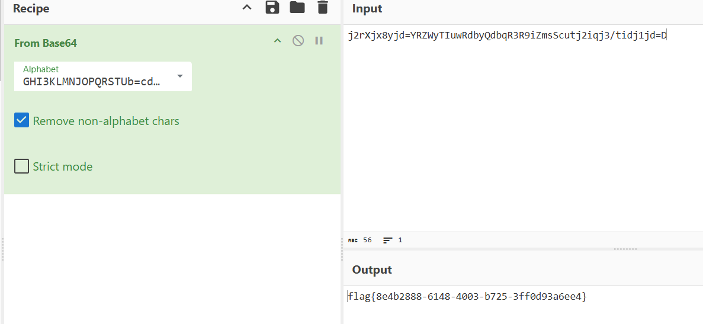

## 1.common_rsa-祥云杯

output0.txt

```
n = 253784908428481171520644795825628119823506176672683456544539675613895749357067944465796492899363087465652749951069021248729871498716450122759675266109104893465718371075137027806815473672093804600537277140261127375373193053173163711234309619016940818893190549811778822641165586070952778825226669497115448984409
e = 31406775715899560162787869974700016947595840438708247549520794775013609818293759112173738791912355029131497095419469938722402909767606953171285102663874040755958087885460234337741136082351825063419747360169129165
c = 97724073843199563126299138557100062208119309614175354104566795999878855851589393774478499956448658027850289531621583268783154684298592331328032682316868391120285515076911892737051842116394165423670275422243894220422196193336551382986699759756232962573336291032572968060586136317901595414796229127047082707519
```

task.py

```
from Crypto.Util.number import getPrime, isPrime, bytes_to_long, inverse
from math import lcm
from secret import flag

def gen(g):
    bits = 512 - g.bit_length()
    while True:
        a = getPrime(bits)
        p = 2 * a * g + 1
        if isPrime(p):
            return p

flag = bytes_to_long(flag)
g = getPrime(320)
p = gen(g)
q = gen(g)
n = p * q
d = getPrime(135)
phi = lcm(p - 1, q - 1)
e = inverse(d, phi)
c = pow(flag, e, n)
print("n = {}".format(n))
print("e = {}".format(e))
print("c = {}".format(c))
```

代码生成了一个320位素数g，gen函数中让p=2ag-1，即p-1=2ag，q-1=2bg，，但是好像并没有是什么用，观察发现n比较小，所以直接分解n可获得

```
p=12080882567944886195662683183857831401912219793942363508618874146487305963367052958581455858853815047725621294573192117155851621711189262024616044496656907
q=21007149684731457068332113266097775916630249079230293735684085460145700796880956996855348862572729597251282134827276249945199994121834609654781077209340587
```

获得

```
d=253784908428481111988210537863274796496485017729407431879694542713372006325205639650253308975237743505823179054885039779285433812553114899686516146069964957819439312685293888278687548695064235618517644833713859508553908998715998244946870285688620601927284558682371178853387703790743662280994769515949576716373
```

那么直接解密即可

参考代码

```
import gmpy2
import math
from Crypto.Util.number import *

n = 253784908428481171520644795825628119823506176672683456544539675613895749357067944465796492899363087465652749951069021248729871498716450122759675266109104893465718371075137027806815473672093804600537277140261127375373193053173163711234309619016940818893190549811778822641165586070952778825226669497115448984409
e = 31406775715899560162787869974700016947595840438708247549520794775013609818293759112173738791912355029131497095419469938722402909767606953171285102663874040755958087885460234337741136082351825063419747360169129165
c = 97724073843199563126299138557100062208119309614175354104566795999878855851589393774478499956448658027850289531621583268783154684298592331328032682316868391120285515076911892737051842116394165423670275422243894220422196193336551382986699759756232962573336291032572968060586136317901595414796229127047082707519
p=12080882567944886195662683183857831401912219793942363508618874146487305963367052958581455858853815047725621294573192117155851621711189262024616044496656907
q=21007149684731457068332113266097775916630249079230293735684085460145700796880956996855348862572729597251282134827276249945199994121834609654781077209340587
phi=(p-1)*(q-1)
d=pow(e,-1,phi)
print(d)
m=pow(c,d,n)
flag=long_to_bytes(m)
print(flag)
```

获得flag{9aecf8d8-6966-4ffa-96b0-2e744d28baf2}

## 2.Sign_in_passwd-CISCN

flag

```
j2rXjx8yjd=YRZWyTIuwRdbyQdbqR3R9iZmsScutj2iqj3/tidj1jd=D
GHI3KLMNJOPQRSTUb%3DcdefghijklmnopWXYZ%2F12%2B406789VaqrstuvwxyzABCDEF5
```

第二个里有%，先试试url解密

获得

```
GHI3KLMNJOPQRSTUb=cdefghijklmnopWXYZ/12+406789VaqrstuvwxyzABCDEF5
```

发现这一串是一整个打乱的base64表

所以应该是base64换表



得到flag{8e4b2888-6148-4003-b725-3ff0d93a6ee4}