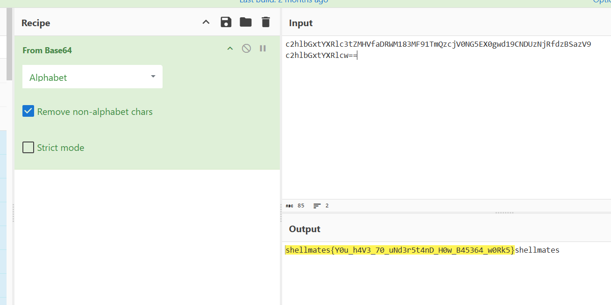

## 1.Broken_Base64- BSides-Algiers

```
描述: 
\> I've broken my base64 encoding, can you help me fix it? > Here it is: ```lbGxtYXRlc3tZMHVfaDRWM183MF91TmQzcjV0NG5EX0gwd19CNDUzNjRfdzBSazV9``` > flag format: ```shellmates{...}
```

加密shellmates获得c2hlbGxtYXRlcw==

对照密文

c2hlbGxtYXRlcw==

lbGxtYXRlc3tZMHVfaDRWM183MF91TmQzcjV0NG5EX0gwd19CNDUzNjRfdzBSazV9

更改为

c2hlbGxtYXRlc3tZMHVfaDRWM183MF91TmQzcjV0NG5EX0gwd19CNDUzNjRfdzBSazV9



获得shellmates{Y0u_h4V3_70_uNd3r5t4nD_H0w_B45364_w0Rk5}

## 2.Morse的笔记本- 宁波天一永安杯

Morse.txt

```
你知道吗。今天我竟然在街上捡到了100元钞票，我当时简直惊呆了，太幸运了。于是我赶紧把钞票捡起来！心里面十分高兴。走了一段路之后，我看见了一个老奶奶在街角卖菜！我就想。这100元钞票对我来说并不是很重要。但对她可能就很有用了。于是我走过去！把钞票递给了她。她非常感激。说我是个好心人。我也因此感到十分快乐！因为我知道。这个世界因为有我们每一个人的善良而变得更美好，今天天气真的很好，我和小丽！小明越好一起去公园玩，在公园里，我们看见了一只可爱的小松鼠，它在树枝上蹦来蹦去！十分活泼可爱。我们还看见了一些漂亮的花朵，它们在微风中轻轻摇曳。像在跳舞一样！我们一边走一边欣赏，一边笑一边玩。真是度过了一个美好的下午。回家的路上！我感到心情特别愉悦。因为我知道。只要心怀善意！天下没有做不成的事情。我经常会感叹人生的短暂。时间的流逝。但我从未停止过前进的步伐！人生路上，有时候你会遇到阻碍。但只要你努力地挑战，不放弃。就能突破困境！实现自己的梦想，所以，不管你遇到什么样的挑战，都不要气馁！坚持下去，你一定会收获成功的喜悦。因为！只有那些坚定自己方向的人，才能走得更远，更自信。当我们遭遇挫折和失败的时候！不要被打倒。要用心去学习，从失败中汲取经验教训。然后重新站起来！更加坚定地追求自己的目标。成功并不是一蹴而就的，需要我们付出长久的努力和坚持！但只要我们一直前进，终究会到达成功的彼岸！所以。让我们一起勇敢面对人生的挑战。迎接成功的喜悦。


mesr{997a9k414dx8m4061u74v15m1y32201k}
```

题目提示Morse，那么应该与摩斯密码有关，且观察文本，仅有，和。可能相关，尝试转化为.-

先尝试。为.那么！为空格获得

```
.--. .- ... ... .-- --- .-. -.. .. ... -.-. --- -. --. .-. .- - ...
```

解码得到PASSWORDISCONGRATS，所以key=CONGRATS

参考代码

```
with open("Morse.txt","r",encoding="utf-8") as f:
    c = f.read()
morse = ""
for char in c:
    if char == "。":
        morse += "."
    elif char == "，":
        morse += "-"
    elif char == "！":
        morse += " "
print(morse)
```

那么对mesr{997a9k414dx8m4061u74v15m1y32201k}进行维吉尼亚解密

得到kqfl{997j9k414kf8k4061g74i15g1h32201k}

再对其进行一键解码，发现为偏移量为5的凯撒密码

flag{997e9f414fa8f4061b74d15b1c32201f}