# 3.28-3.31:

## 1、3-track_hacker-Bugku：

下载后得到一个pcap的流量包对其进行流量分析先查找一下flag的字眼查到发现一个flag.txt的字眼，追踪一下tcp流可以看到

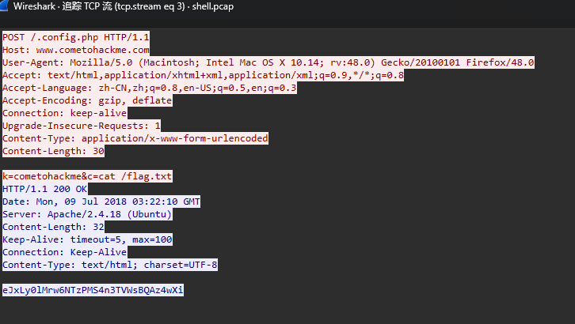 

当时以为要将这个flag.txt的文件弄出来，尝试了导出一下文件但是什么都没发现，后面才发现最后一行有一个类似base编码的密文，我们放到随波逐流里面进行解密但输出的是乱码然后就没有头绪了看了一下bugku的评论区说还要进行解压处理

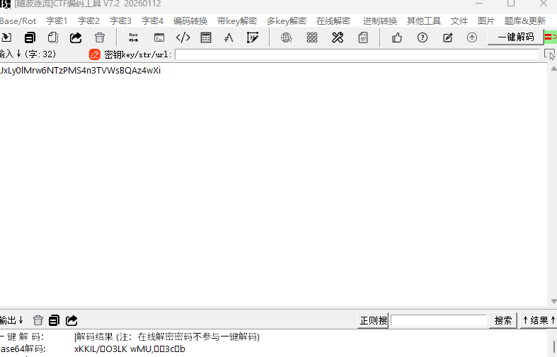 

进行解密及解压的python代码如下：

```python
import base64
import zlib
flag = "eJxLy0lMrw6NTzPMS4n3TVWsBQAz4wXi"
decoded = base64.b64decode(flag)
result = zlib.decompress(decoded)
print(result)
```

运行后就可以得到我们的flag：b'flag{U_f1nd_Me!}'

## 2、3-Not_only_base-Bugku:

下载后得到一个无后缀的文件老样子先改成txt看能不能阅读改完后里面的内容为：MCJIJSGKP=ZZYXZXRMU=W3YZG3ZZ==G3HQHCUS==

这个很明显是某种编码然后又有等号的话只有base类型的，但是base类型的等号都是在末尾的，想到栅栏密码可以改变字符串的顺序，先将原始的密文放到随波逐流里面进行栅栏解密找到等号都在最后的解密结果

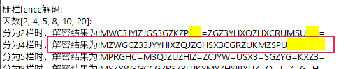 

然后再进行解密就可以得到flag：flag{N0t_0NLy_b4sE32}

## 3、RSA2-Bugku：

下载后得到RSA算法的几个重要参数

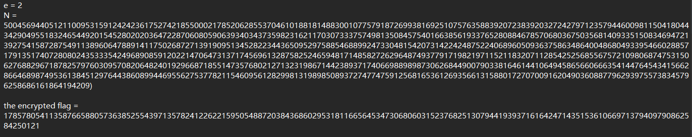 

看到e=2知道了这是道低指数加密的题目先看看能不能分解N

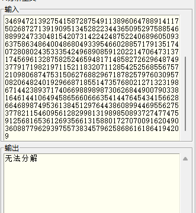 

看来这个N没办法分解，那就尝试直接对密文进行开平方处理对应的py代码如下：

```python
import gmpy2
c = 178578054113587665880573638525543971357824122622159505488720384368602953181166564534730680603152376825130794419393716164247143515361066971379409790862584250121
m = gmpy2.isqrt(c)
if m*m == c:
    print("m =", m)
    print("hex =", hex(m))
    print("bytes =", bytes.fromhex(hex(m)[2:]))
else:
    print("not exact square")
```

运行后果然找到了我们的flag：

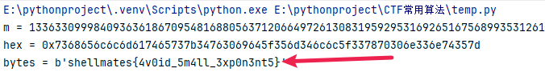 

## 4、source-Bugku：

打开靶机后按f12查看一下源码，发现有个flag：flag{Zmxhz19ub3RfaGvyzSEHIQ==}直接提交显然不对，里面还有个类似base编码的密码，先进行一下解密看一下

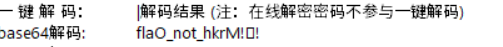 

看样子这个flag根本就不是正确答案，先扫个目录看一下

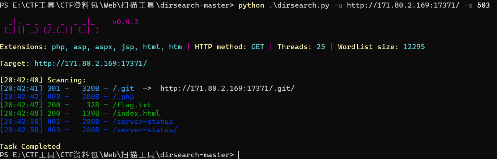 

找到一个flag.txt的文件和一个git目录，先看一下txt中有没有东西

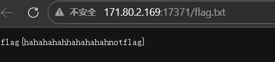 

呃好吧又被耍了这个不是flag那就是git泄露了，去Kail里面修复一下git目录，先用wget命令下载全部的文件

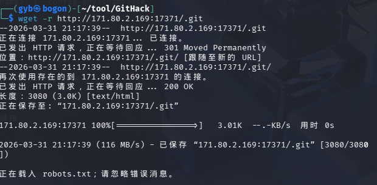 

下载完成后去这个目录里面打开终端使用 git reflog 查看历史操作记录

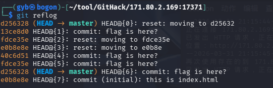 

可以看到有一堆的前缀就只能一个个的试了最后40c6d51是正确的地址

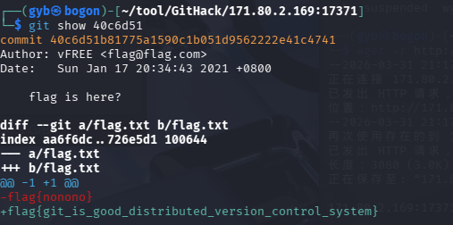 

在被耍了两次后终于是找到了正确的flag：flag{git_is_good_distributed_version_control_system}

## 5、Crack Zip-Bugku：

下载后发现压缩包需要密码，用ARCHPR对密码进行一下破解，因为不知道密码格式，先尝试一下全数字不断的修改一下范围最后破解成功

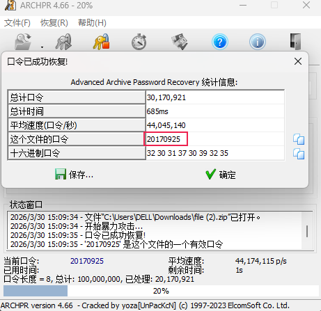 

得到密码20170925，输入后解压缩得到flag：Susctf{ec1717de879b19792c77f5edacbb84dc}

## 6、鲲or鳗orGame-Bugku：

文件下载下来有一个gb文件和两个音频文件，不知道啥是gb文件搜了一下是一种游戏文件需要用vb模拟器进行打开来游玩，杂项的这种题一般都是要去玩的，下了vb模拟器打开后，什么界面都没提示摸索了半天才发现按enter启动，启动后为第二张图显示，然后说按A但是咋按都没反应

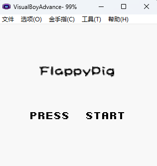 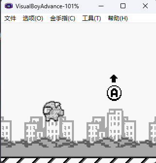 

然后再去摸索找到了。我去原来要按z键

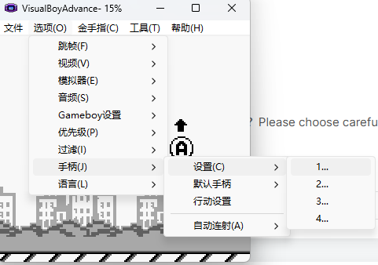 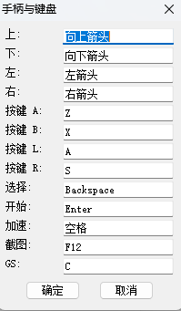 

开始玩游戏，这游戏是真的难玩啊，随便跳几下就死了根本找不到任何flag的头绪啊，看了眼wp要通过第二根柱子才能拿到flag，通过第一个时点击查找金手指可以找到一堆地址

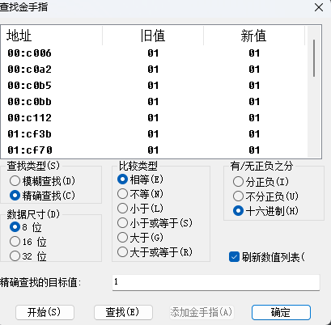 

通过第二个柱子后再进行查找

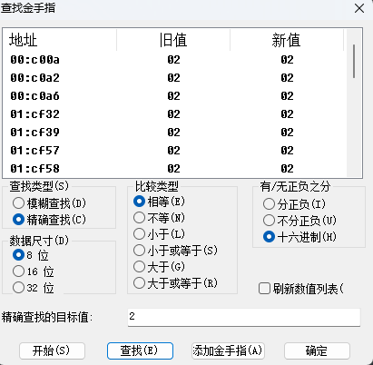 

然后就是对地址进行修改，只能一个个的去试，最后发现正确的地址是00：c0a2，去修改这个地址的数值达到最大也就是255，因为是16进制所以修改ff

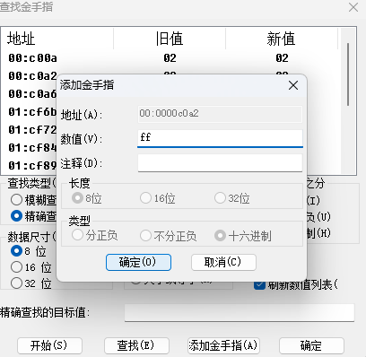 

保存后再进行一把游戏死了后就会直接显示出来flag：flag{PS03R49UE576R421RE8}

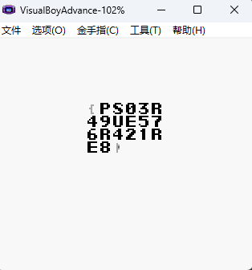 

只能说这题目真有点抽象来的吧

## 7、强网先锋打野-Bugku：

下载后得到一张bmp的图片，一般这种杂项的题目都是图片隐写的题目，看那个评论区说只能用zsteg来解这道题目，我们在kail上装好zsteg来解这道题目

```bash
git clone https://github.com/zed-0xff/zsteg
cd zsteg/
gem install zsteg
```

查看一下图片的LSB的信息

```bash
zsteg 瞅啥.bmp
```

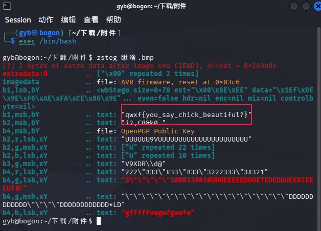 

没想到直接把flag给我们了真是太贴心了

## 8、EasyXor-Bugku:

文件下载后放到IDA里面进行分析找到main函数部分

```c
int __fastcall main(int argc, const char **argv, const char **envp)
{
  char v4; // [rsp+Fh] [rbp-91h]
  int v5; // [rsp+10h] [rbp-90h]
  int i; // [rsp+14h] [rbp-8Ch]
  int v7; // [rsp+18h] [rbp-88h]
  _DWORD v8[24]; // [rsp+20h] [rbp-80h]
  char s[24]; // [rsp+80h] [rbp-20h] BYREF
  unsigned __int64 v10; // [rsp+98h] [rbp-8h]
  v10 = __readfsqword(0x28u);
  v8[0] = 83;
  v8[1] = 116;
  v8[2] = 113;
  v8[3] = 96;
  v8[4] = 112;
  v8[5] = 99;
  v8[6] = 125;
  v8[7] = 78;
  v8[8] = 87;
  v8[9] = 103;
  v8[10] = 57;
  v8[11] = 110;
  v8[12] = 104;
  v8[13] = 82;
  v8[14] = 102;
  v8[15] = 106;
  v8[16] = 113;
  v8[17] = 32;
  v8[18] = 123;
  v8[19] = 125;
  v8[20] = 115;
  v8[21] = 104;
  v5 = 0;
  v4 = 1;
  puts("Mercy: What do you want to tell me?");
  scanf("%s", s);
  v7 = strlen(s);
  if ( v7 != 22 )
    puts("You Are Defented;");
  for ( i = 0; i < v7; ++i )
  {
    if ( v5 )
    {
      if ( v8[i] != (i ^ s[i]) )
        v4 = 0;
      v5 = 0;
    }
    else
    {
      if ( v8[i] != (i ^ s[i]) )
        v4 = 0;
      v5 = 1;
    }
  }
  if ( v4 )
    puts("Heros never die~Victory~");
  else
    puts("You Are Defented;");
  return 0;
}
```

这是一个典型的 输入验证 程序，核心逻辑是：程序内置了一个加密后的数组 v8（长度为 22），要求用户输入一个 22 个字符的字符串，通过某种变换与 v8 比较，验证成功输出 "Heros never die~Victory~"，失败输出 "You Are Defented;"。要得到正确的输入 s，需要计算s[i] = v8[i] XOR i，我们写一个python脚本来进行解密即可：

```python
v8 = [83,116,113,96,112,99,125,78,87,103,57,110,104,82,102,106,113,32,123,125,115,104]
flag = ''.join([chr(v8[i] ^ i) for i in range(len(v8))])
print(flag)
```

运行后输出flag：Susctf{I_n3ed_hea1ing}

## 9、强网先锋AD-Bugku:

下载文件后放进IDA里面进行分析找到main函数里面发现有一串base的编码

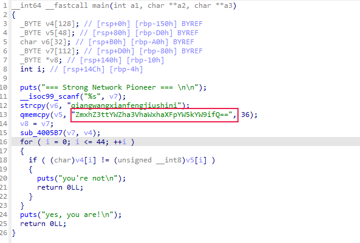 

放进随波逐流里面进行解密就可以直接得到flag：flag{mafakuailaiqiandaob}

 

# 4.1-4.4：

## 1、Crack it-Bugku：

下载后是一个无后缀的文件放到010里面先看一眼

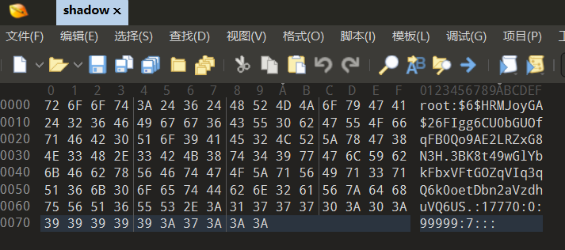 

这看起来是一个 Linux /etc/shadow 文件中的一行，包含用户的密码哈希信息,这类题通常是 破解 root 密码，去Kail里面用John破解root密码

```bash
echo 'root:$6$HRMJoyGA$26FIgg6CU0bGUOfqFB0Qo9AE2LRZxG8N3H.3BK8t49wGlYbkFbxVFtGOZqVIq3qQ6k0oetDbn2aVzdhuVQ6US.:17770:0:99999:7:::' > shadow.txt
```

先将文件的内容保存成txt文件再用命令将密码破解出来

```bash
john --show shadow.txt
```

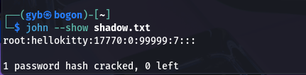 

可以看到密码是hellokitty，那么这道题目的flag就是flag{hellokitty}

## 2、一段新闻-Bugku：

下载后打开后发现有奇奇怪怪的空格

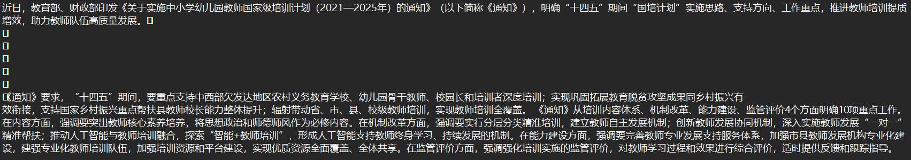 

放进随波逐流里面分析一下发现有零宽加密的信息

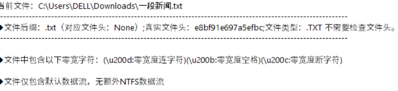 

先解密出来看是什么，在线解密工具网址为https://fly63.com/tool/txtencrypt/

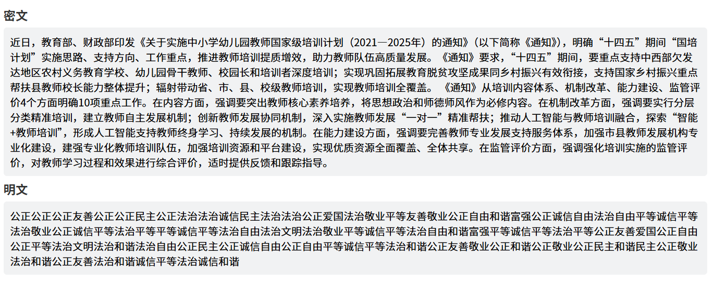 

发现解密出来后是社会主义核心价值观加密，再进行解密就可以得到flag

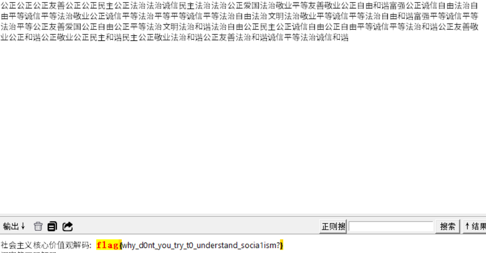 

## 3、easy_hash-Bugku：

下载后得到一个输出附件和一个py加密代码，加密代码如下：

```python
import hashlib
from multiprocessing import Pool
def compute_md5(char):
    md5_flag = hashlib.md5(char.encode()) # 将字符编码为字节串（默认UTF-8），然后计算MD5
    return md5_flag.hexdigest() # 返回16进制格式的MD5值（固定32位长度）
if __name__ == '__main__':
    with open('flag', 'r') as flag_file:
        content = flag_file.read()
        chars = list(content) # 将字符串转换为字符列表，例如 "abc" -> ['a', 'b', 'c']
        with Pool() as pool:
            # pool.map() 将 compute_md5 函数应用到 chars 列表的每个元素
            # 相当于并行执行： [compute_md5('a'), compute_md5('b'), ...]
            # 返回结果列表，顺序与输入保持一致
            md5_results = pool.map(compute_md5, chars)
        with open('output', 'w') as output_file:
            for result in md5_results:
                output_file.write(result + '\n')
```

对此我们可以直接写出解密的脚本：

```python
import hashlib
def crack_md5_to_char(md5_hash):
    """通过预计算所有可打印字符的MD5来反向查找"""
    # 常见字符范围：可打印ASCII (32-126) 加上换行等
    for code in range(32, 127):
        char = chr(code)
        if hashlib.md5(char.encode()).hexdigest() == md5_hash:
            return char
    return '?'
def decode_flag(output_file):
    """解密output文件，还原原始flag"""
    result = []
    with open(output_file, 'r') as f:
        for line in f:
            md5_hash = line.strip()
            if md5_hash:
                char = crack_md5_to_char(md5_hash)
                result.append(char)
    return ''.join(result)
# 执行解密
flag = decode_flag('output')
print(f"原始flag: {flag}")
```

运行后直接就可以得到我们的flag：flag{We1c0me_t0_the_w0r1d_0f_md5}

## 4、你喜欢下棋吗-Bugku：

下载后发现有个压缩包和解压密码的文件打开后

 

先解密一下，根据提示说的下棋，在随波逐流里面一键解密并到找相关的内容

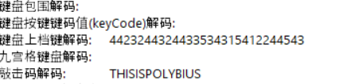 

可以看到只有敲击码符合大小写的规则全部小写后就是压缩包的密码：thisispolybius。进去后发现还有一个加密密文

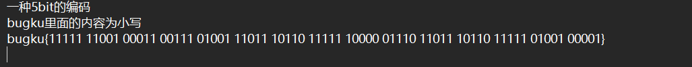 

一种5bit的编码很容易想到博多码解码后得到：

 

再换成小写加上bugku{}就是正确的flag

## 5、小山丘的秘密-Bugku：

下载后得到flag文件和一张棋盘图片，其中flag文件里面的内容是经过加密的根据题目名称小山丘的秘密可以想到这个是hill也就是希尔加密用在线网站(https://ctf.bugku.com/tool/hill)进行解密其中密钥部分就是棋盘里面棋子的数量，模式在文档里面已经给我们给出来了

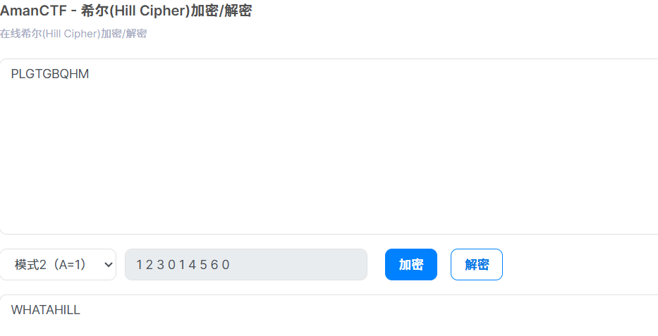 

解出来之后全部小写就是flag

## 6、baby_N1ES-Bugku：

下载后得到两个py代码，N1ES.py的内容是：

```python
# -*- coding: utf-8 -*-
def round_add(a, b):
    f = lambda x, y: x + y - 2 * (x & y)
    res = ''
    for i in range(len(a)):
        res += chr(f(ord(a[i]), ord(b[i])))
    return res
def permutate(table, block):
	return list(map(lambda x: block[x], table))
def string_to_bits(data):
    data = [ord(c) for c in data]
    l = len(data) * 8
    result = [0] * l
    pos = 0
    for ch in data:
        for i in range(0,8):
            result[(pos<<3)+i] = (ch>>i) & 1
        pos += 1
    return result
s_box = [54, 132, 138, 83, 16, 73, 187, 84, 146, 30, 95, 21, 148, 63, 65, 189, 188, 151, 72, 161, 116, 63, 161, 91, 37, 24, 126, 107, 87, 30, 117, 185, 98, 90, 0, 42, 140, 70, 86, 0, 42, 150, 54, 22, 144, 153, 36, 90, 149, 54, 156, 8, 59, 40, 110, 56,1, 84, 103, 22, 65, 17, 190, 41, 99, 151, 119, 124, 68, 17, 166, 125, 95, 65, 105, 133, 49, 19, 138, 29, 110, 7, 81, 134, 70, 87, 180, 78, 175, 108, 26, 121, 74, 29, 68, 162, 142, 177, 143, 86, 129, 101, 117, 41, 57, 34, 177, 103, 61, 135, 191, 74, 69, 147, 90, 49, 135, 124, 106, 19, 89, 38, 21, 41, 17, 155, 83, 38, 159, 179, 19, 157, 68, 105, 151, 166, 171, 122, 179, 114, 52, 183, 89, 107, 113, 65, 161, 141, 18, 121, 95, 4, 95, 101, 81, 156, 17, 190, 38, 84, 9, 171, 180, 59, 45, 15, 34, 89, 75, 164, 190, 140, 6, 41, 188, 77, 165, 105, 5, 107, 31, 183, 107, 141, 66, 63, 10, 9, 125, 50, 2, 153, 156, 162, 186, 76, 158, 153, 117, 9, 77, 156, 11, 145, 12, 169, 52, 57, 161, 7, 158, 110, 191, 43, 82, 186, 49, 102, 166, 31, 41, 5, 189, 27]
def generate(o):
    k = permutate(s_box,o)
    b = []
    for i in range(0, len(k), 7):
        b.append(k[i:i+7] + [1])
    c = []
    for i in range(32):
		pos = 0
		x = 0
		for j in b[i]:
			x += (j<<pos)
			pos += 1
		c.append((0x10001**x) % (0x7f))
    return c
class N1ES:
    def __init__(self, key):
        if (len(key) != 24 or isinstance(key, bytes) == False ):
            raise Exception("key must be 24 bytes long")
        self.key = key
        self.gen_subkey()

    def gen_subkey(self):
        o = string_to_bits(self.key)
        k = []
        for i in range(8):
	        o = generate(o)
        	k.extend(o)
        	o = string_to_bits([chr(c) for c in o[0:24]])
        self.Kn = []
        for i in range(32):
            self.Kn.append(map(chr, k[i * 8: i * 8 + 8]))
        return 

    def encrypt(self, plaintext):
        if (len(plaintext) % 16 != 0 or isinstance(plaintext, bytes) == False):
            raise Exception("plaintext must be a multiple of 16 in length")
        res = ''
        for i in range(len(plaintext) / 16):
            block = plaintext[i * 16:(i + 1) * 16]
            L = block[:8]
            R = block[8:]
            for round_cnt in range(32):
                L, R = R, (round_add(L, self.Kn[round_cnt]))
            L, R = R, L
            res += L + R
        return res             
```

challenge.py的内容为：

```python
from N1ES import N1ES
import base64
key = "wxy191iss00000000000cute"
n1es = N1ES(key)
flag = "N1CTF{*****************************************}"
cipher = n1es.encrypt(flag)
print base64.b64encode(cipher)  # HRlgC2ReHW1/WRk2DikfNBo1dl1XZBJrRR9qECMNOjNHDktBJSxcI1hZIz07YjVx
```

可以分析出关键点是round_add 实际上是XOR操作，Feistel网络解密只需将轮密钥逆序使用，密钥调度算法需要完全重现才能生成正确的轮密钥，由此我们可以写出解题的脚本，为了防止版本的问题我这里用sage代码来进行解密

```python
# -*- coding: utf-8 -*-
# SageMath 9.0+ 环境运行
import base64
# ==================== 原始加密算法的函数 ====================
def round_add(a, b):
    """
    轮函数：实际上是XOR操作
    x + y - 2*(x&y) = x XOR y
    """
    f = lambda x, y: x + y - 2 * (x & y)
    res = ''
    for i in range(len(a)):
        res += chr(f(ord(a[i]), ord(b[i])))
    return res
def permutate(table, block):
    """根据置换表重新排列"""
    return list(map(lambda x: block[x], table))
def string_to_bits(data):
    """字符串转比特列表（小端序）"""
    data = [ord(c) for c in data]
    l = len(data) * 8
    result = [0] * l
    pos = 0
    for ch in data:
        for i in range(0, 8):
            result[(pos << 3) + i] = (ch >> i) & 1
        pos += 1
    return result
def bits_to_string(bits):
    """比特列表转字符串"""
    result = ''
    for i in range(0, len(bits), 8):
        byte = 0
        for j in range(8):
            if i + j < len(bits):
                byte |= (bits[i + j] << j)
        if byte > 0:
            result += chr(byte)
    return result
# S-box
s_box = [
    54, 132, 138, 83, 16, 73, 187, 84, 146, 30, 95, 21, 148, 63, 65, 189,
    188, 151, 72, 161, 116, 63, 161, 91, 37, 24, 126, 107, 87, 30, 117, 185,
    98, 90, 0, 42, 140, 70, 86, 0, 42, 150, 54, 22, 144, 153, 36, 90, 149,
    54, 156, 8, 59, 40, 110, 56, 1, 84, 103, 22, 65, 17, 190, 41, 99, 151,
    119, 124, 68, 17, 166, 125, 95, 65, 105, 133, 49, 19, 138, 29, 110, 7,
    81, 134, 70, 87, 180, 78, 175, 108, 26, 121, 74, 29, 68, 162, 142, 177,
    143, 86, 129, 101, 117, 41, 57, 34, 177, 103, 61, 135, 191, 74, 69, 147,
    90, 49, 135, 124, 106, 19, 89, 38, 21, 41, 17, 155, 83, 38, 159, 179, 19,
    157, 68, 105, 151, 166, 171, 122, 179, 114, 52, 183, 89, 107, 113, 65,
    161, 141, 18, 121, 95, 4, 95, 101, 81, 156, 17, 190, 38, 84, 9, 171, 180,
    59, 45, 15, 34, 89, 75, 164, 190, 140, 6, 41, 188, 77, 165, 105, 5, 107,
    31, 183, 107, 141, 66, 63, 10, 9, 125, 50, 2, 153, 156, 162, 186, 76, 158,
    153, 117, 9, 77, 156, 11, 145, 12, 169, 52, 57, 161, 7, 158, 110, 191, 43,
    82, 186, 49, 102, 166, 31, 41, 5, 189, 27
]
def generate(o):
    """
    密钥生成核心函数
    使用S-box置换和模幂运算
    """
    # 步骤1: 通过S-box置换
    k = permutate(s_box, o)
    
    # 步骤2: 每7位加1位结束符，分成32组
    b = []
    for i in range(0, len(k), 7):
        if i + 7 <= len(k):
            b.append(k[i:i+7] + [1])
    # 步骤3: 每组转换为数值并进行模幂运算
    c = []
    for i in range(32):
        pos = 0
        x = 0
        for j in b[i]:
            x += (j << pos)
            pos += 1
        # 使用SageMath的power_mod进行模幂
        # 0x10001 = 65537 (RSA常用指数)
        c.append(power_mod(0x10001, x, 0x7f))
    return c
# ==================== N1ES加密类 ====================
class N1ES:
    def __init__(self, key):
        """
        初始化，key必须是24字节的bytes对象
        """
        if len(key) != 24 or not isinstance(key, bytes):
            raise Exception("key must be 24 bytes long")
        self.key = key.decode('latin-1')  # 转为字符串便于处理
        self.gen_subkey()
    def gen_subkey(self):
        """
        生成32轮轮密钥，每轮8字节
        """
        # 将密钥转换为比特列表
        o = string_to_bits(self.key)
        k = []
        # 迭代8次生成足够的密钥材料
        for i in range(8):
            o = generate(o)
            k.extend(o)
            # 取前24字节作为下一轮的输入
            o = string_to_bits([chr(c) for c in o[0:24]])
        # 分成32组，每组8个字节
        self.Kn = []
        for i in range(32):
            self.Kn.append([chr(c) for c in k[i*8:(i+1)*8]])
        return
    def encrypt(self, plaintext):
        """
        Feistel网络加密
        """
        if len(plaintext) % 16 != 0 or not isinstance(plaintext, bytes):
            raise Exception("plaintext must be a multiple of 16 in length")
        
        plaintext = plaintext.decode('latin-1')
        res = ''
        # 按16字节块处理
        for i in range(len(plaintext) // 16):
            block = plaintext[i*16:(i+1)*16]
            L = block[:8]
            R = block[8:]            
            # 32轮Feistel加密
            for round_cnt in range(32):
                L, R = R, round_add(L, self.Kn[round_cnt])          
            # 最后一轮后交换
            L, R = R, L
            res += L + R 
        return res.encode('latin-1')
    def decrypt(self, ciphertext):
        """
        Feistel网络解密：轮密钥逆序使用
        """
        if len(ciphertext) % 16 != 0 or not isinstance(ciphertext, bytes):
            raise Exception("ciphertext must be a multiple of 16 in length")
        ciphertext = ciphertext.decode('latin-1')
        res = ''
        # 按16字节块处理
        for i in range(len(ciphertext) // 16):
            block = ciphertext[i*16:(i+1)*16]
            L = block[:8]
            R = block[8:]          
            # 32轮Feistel解密（轮密钥逆序）
            for round_cnt in range(31, -1, -1):
                L, R = R, round_add(L, self.Kn[round_cnt])          
            # 最后一轮后交换
            L, R = R, L
            res += L + R       
        return res.encode('latin-1'）
# ==================== 主程序 ====================
def main():
    print("=" * 60)
    print("N1ES 解密程序 (SageMath版本)")
    print("=" * 60)   
    # 已知密文（Base64编码）
    cipher_b64 = "HRlgC2ReHW1/WRk2DikfNBo1dl1XZBJrRR9qECMNOjNHDktBJSxcI1hZIz07YjVx"
    print(f"\n[+] 密文 (Base64): {cipher_b64}")
    # Base64解码
    cipher = base64.b64decode(cipher_b64)
    print(f"[+] 密文长度: {len(cipher)} 字节")
    # 密钥（24字节）
    key = b"wxy191iss00000000000cute"
    print(f"[+] 密钥: {key}")
    print(f"[+] 密钥长度: {len(key)} 字节")
    # 创建N1ES实例
    print("\n[+] 初始化N1ES...")
    n1es = N1ES(key)
    # 解密
    print("[+] 开始解密...")
    flag = n1es.decrypt(cipher)
    # 输出结果
    print("\n" + "=" * 60)
    print("解密结果:")
    print("=" * 60)
    print(flag.decode('latin-1'))
    # 验证flag格式
    flag_str = flag.decode('latin-1')
    if flag_str.startswith('N1CTF{') and flag_str.endswith('}'):
        print("\n✓ 成功解密！Flag格式正确。")
    else:
        print("\n⚠ 警告：解密结果格式可能不正确，请检查。")
# ==================== 额外分析函数 ====================
def analyze_key_schedule():
    """
    分析密钥调度过程（调试用）
    """
    print("\n" + "=" * 60)
    print("密钥调度分析")
    print("=" * 60)
    key = b"wxy191iss00000000000cute"
    n1es = N1ES(key)
    print(f"\n生成了 {len(n1es.Kn)} 轮密钥")
    print(f"每轮密钥长度: {len(n1es.Kn[0])} 字节")
    print("\n前3轮密钥:")
    for i in range(3):
        print(f"  Round {i:2d}: {''.join(n1es.Kn[i])}")
    return n1es.Kn
def test_round_add():
    """
    测试round_add函数
    """
    print("\n" + "=" * 60)
    print("round_add 函数测试")
    print("=" * 60)
    a = "abcdefgh"
    b = "12345678"
    result = round_add(a, b)    
    print(f"a = {a}")
    print(f"b = {b}")
    print(f"a XOR b = {result}")
    # 验证确实是XOR
    for i in range(8):
        x = ord(a[i]) ^ ord(b[i])
        y = ord(result[i])
        print(f"  {a[i]}({ord(a[i]):3d}) ^ {b[i]}({ord(b[i]):3d}) = {x:3d} -> {result[i]}({y:3d}) {'✓' if x == y else '✗'}")
# ==================== 运行主程序 ====================
if __name__ == "__main__":
    # 运行测试
    test_round_add()   
    # 运行主解密程序
    main()    
    # 可选：分析密钥调度
    # analyze_key_schedule()
```

运行后就可以直接得到flag：N1CTF{F3istel_n3tw0rk_c4n_b3_ea5i1y_s0lv3d_/--/}

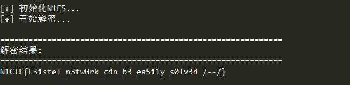 

## 7、EN-气泡-Bugku:

下载附件后得到一串字符串：xivak-notuk-cupad-tarek-zesuk-zupid-taryk-zesak-cined-tetuk-nasuk-zoryd-tirak-zysek-zaryd-tyrik-nisyk-nenad-tituk-nysil-hepyd-tovak-zutik-cepyd-toral-husol-henud-titak-hesak-nyrud-tarik-netak-zapad-tupek-hysek-zuned-tytyk-zisuk-hyped-tymik-hysel-hepad-tomak-zysil-nunad-tytak-nirik-copud-tevok-zasyk-nypud-tyruk-niryk-henyd-tityk-zyral-nyred-taryk-zesek-corid-tipek-zysek-nunad-tytal-hitul-hepod-tovik-zurek-hupyd-tavil-hesuk-zined-tetuk-zatel-hopod-tevul-haruk-cupod-tavuk-zesol-ninid-tetok-nasyl-hopid-teryl-nusol-heped-tovuk-hasil-nenod-titek-zyryl-hiped-tivyk-cosok-zorud-tirel-hyrel-hinid-tetok-hirek-zyped-tyrel-hitul-nyrad-tarak-hotok-cuvux也没什么规律，先放到随波逐流里面看一眼，什么都没有，根据题目标题可以知道还有个气泡加密的算法，用py写出破解脚本

```python
from bubblepy import BubbleBabble
# 待解密的字符串
encoded_str = 'xivak-notuk-cupad-tarek-zesuk-zupid-taryk-zesak-cined-tetuk-nasuk-zoryd-tirak-zysek-zaryd-tyrik-nisyk-nenad-tituk-nysil-hepyd-tovak-zutik-cepyd-toral-husol-henud-titak-hesak-nyrud-tarik-netak-zapad-tupek-hysek-zuned-tytyk-zisuk-hyped-tymik-hysel-hepad-tomak-zysil-nunad-tytak-nirik-copud-tevok-zasyk-nypud-tyruk-niryk-henyd-tityk-zyral-nyred-taryk-zesek-corid-tipek-zysek-nunad-tytal-hitul-hepod-tovik-zurek-hupyd-tavil-hesuk-zined-tetuk-zatel-hopod-tevul-haruk-cupod-tavuk-zesol-ninid-tetok-nasyl-hopid-teryl-nusol-heped-tovuk-hasil-nenod-titek-zyryl-hiped-tivyk-cosok-zorud-tirel-hyrel-hinid-tetok-hirek-zyped-tyrel-hitul-nyrad-tarak-hotok-cuvux'
# 创建BubbleBabble对象
bubble = BubbleBabble()
# 解密
decoded_str = bubble.decode(encoded_str)
print(decoded_str)
```

得到的结果仍是气泡加密的形式，总共进行三次解密就可以得到我们的flag：bugku{th1s_1s_A_Bubb13}

